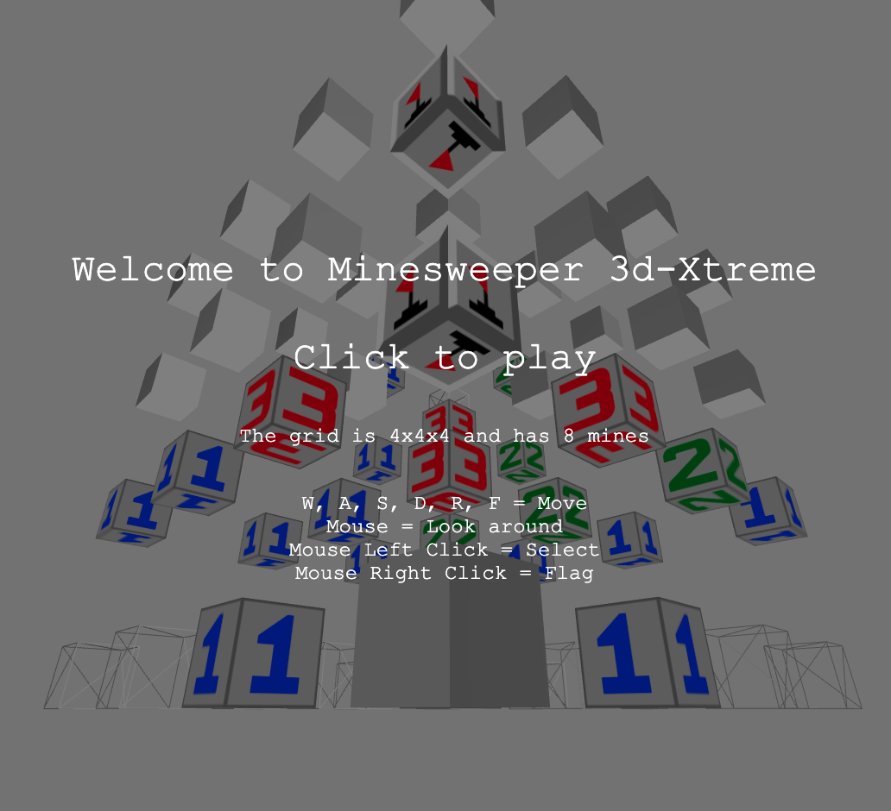
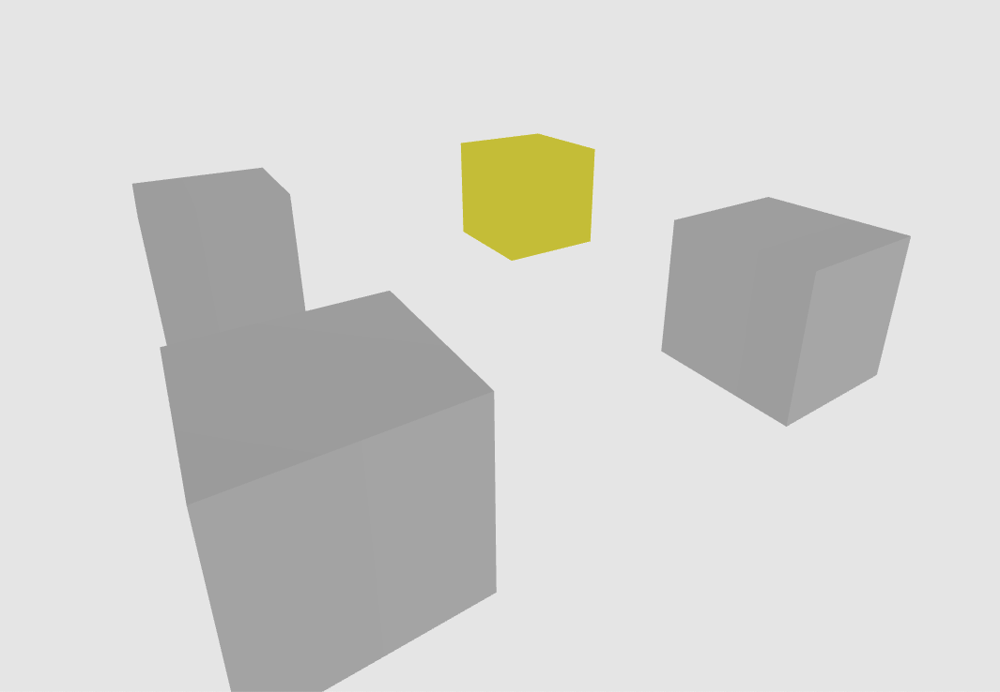
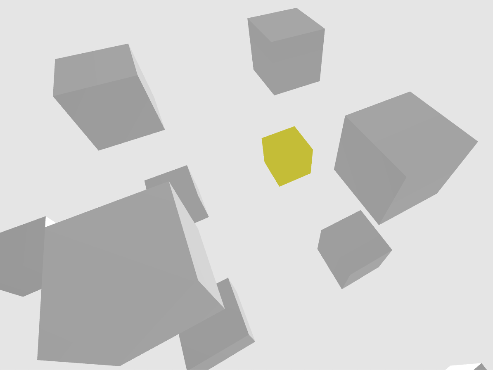

<h1>
Technologies
</h1>

JavaScript, ThreeJS, ThreeJSx, CSS, HTML5

<h1>
Game Introduction and Pictures:
</h1>


 
Let us take a look at the yellow highlighted cubes in the following pictures. 

1. In 2D minesweeper, the game has only one plane. Therefore, the yellow cube's neighbors are the cubes next to it: left, right and diagonal.



The maximum number of neighbors with one plane is 8. 

2. In 3D minesweeper, the cube's neighbors include the cubes on both the planes above and below itself. This example only demonstrates neighbors on the plane above since the yellow cube has no plane below. 



The maximum number of neighbors in 3D is 26: 9 cubes on the plane below, 8 cubes on the same plane, 9 cubes on the plane above. 

Have Fun!

<h1>
Code Snippets
</h1>

<h2>
User Interface: Raycasting & Enclosure of pickedObj & Nesting of EventListeners
</h2>

Because I was developing in 3D, I had issues with user interface because event listeners click and hover would select cubes directly behind the initially selected cube. This would be a frustrating experience for the player because the player would activate cubes unintentionally. The solution was adding Raycasting. Raycasting creates an instance of a ray/line through the 3D scene with two input coordinates: camera position (x1,y1,z1) and cube position (x2,y2,z2). Any intersected object from the ray would be pushed to an array. For my game, I only needed to identify the first cube, so I key into the first element of the array. Implementing Raycasting is provided by the ThreeJS tutorial documents. However, in order to use Raycasting effectively for my project, I needed to tinker with my code. 

Because the pickedObj from the ray instances did not have the texture/material/mesh attributes, I was not able to change the cube's appearance upon a event action. Initially, I failed-attempted to pass down the cube object into the ray instance. The passing down means I assigned a key-value pair in the ray instance. This did not work, because while the ray instance correctly identifed the 1st cube, the passed-down cube was from the cube coordinates that the ray takes in as input. For example, if I hovered over 2 cubes, then two ray instances are created. Both ray rays correctly identify the first cube, but I would update the texture/material/mesh appearance of the the passed-down cube instead. 

After realizing my initial mistakes, my second attempt to fix the issue by enclosing the variable pickedObj and nesting event listeners mouseover, mouseout, and mousdown was successful. I am still passing down the cubeGL, mesh and material in this.geometry, which is accessible in the ray instance POJO. I declare and define the pickedObj variable in the mouseover event. When clicking on the object, I enclose the pickedObj in the nested event listeners. Note that the mouseout is intentionally set to "this" because I want all hovered cube's appearances reset to default settings.

```
class CubeUI {
    constructor(x,y,z) {
        this.cubeGL = g.planes[z+1].grid[x+1][y+1];

        this.geometry = new THREE.BoxGeometry(1, 1, 1);
        this.material = new THREE.MeshLambertMaterial({ color: 0xD3D3D3 }); // gray
        this.mesh = new THREE.Mesh(this.geometry, this.material);

        // passing down cubeGL, mesh, material like passing down props in React
        this.geometry.cubeGL = this.cubeGL;
        this.geometry.mesh = this.mesh;
        this.geometry.material = this.material;

        this.mesh.position.x = x*3;
        this.mesh.position.y = y*3;
        this.mesh.position.z = z*3;
        
        scene.add(this.mesh);

        const domEvents = new THREEx.DomEvents(camera, renderer.domElement);
        let texture;

        domEvents.addEventListener(this.mesh, 'mouseover', event => {
            pickHelper = new PickHelper

            pickPosition.x = (event.origDomEvent.clientX / canvas.clientWidth)  * 2 - 1;
            pickPosition.y = (event.origDomEvent.clientY / canvas.clientHeight)  * -2 + 1;
            pickedObj = pickHelper.pick(pickPosition, scene, camera);

            if (pickedObj.geometry.cubeGL.hidden === true) pickedObj.material.color.setHex('0xFFFF00');

            domEvents.addEventListener(this.mesh, 'mouseout', event => {
                if (this.cubeGL.hidden === true) {
                    this.material.color.setHex('0xD3D3D3');
                    this.geometry.material.color.setHex('0xD3D3D3');
                }
            })

            domEvents.addEventListener(this.mesh, 'mousedown', eventClick => {
                pickedObj['eventClick'] = eventClick;

                switch (pickedObj.eventClick.origDomEvent.button) {

                    case 0:
                        // console.log("left click")
                        if (pickedObj.geometry.cubeGL.hidden === 'flagged') {
                            // do nothing
                        } else {
                            pickedObj.geometry.cubeGL.hidden === false;
                            
                            g.makeMove(pickedObj.geometry.cubeGL.row, pickedObj.geometry.cubeGL.col, pickedObj.geometry.cubeGL.plane);

                            if (pickedObj.geometry.cubeGL.value === 'Mine') {
                                // removed for code snippet
                            } else if (pickedObj.geometry.cubeGL.value === 'vac') { 
                                // removed for code snippet
                            }
                            // removed for code snippet
                        }

                        break;
                    case 2:
                        // console.log("right click")
                        // removed for code snippet
                }
            })
        })
```
This was difficult to debug, but turned into a good learning experience as I now understand Raycasting better after correcting the incorrect event behavior. 

<h2>
Game Logic: Data Structure & Recursion
</h2>

 In regular minesweeper, when the player selects a vacant square, the selection reveals all neighboring squares with values either vacant or the count of neighboring bombs. Each instance of cube has an attribute neighbors, which is an object that points to its neighboring cubes. This demonstrates the use of the graph data structure. 
 
 ```
    setNeighbors(plane, idx) {
        let neighbors;
        
        for (let row=1; row < plane.row-1; row++) {
            for (let col=1; col < plane.col-1; col++) { 

                neighbors = {
                    upPlane: {
                        "up": this.planes[idx - 1].grid[row][col],
                        "N": this.planes[idx - 1].grid[row - 1][col],
                        "NE": this.planes[idx - 1].grid[row - 1][col + 1],
                        "E": this.planes[idx - 1].grid[row][col + 1],
                        "SE": this.planes[idx - 1].grid[row + 1][col + 1],
                        "S": this.planes[idx - 1].grid[row + 1][col],
                        "SW": this.planes[idx - 1].grid[row + 1][col - 1],
                        "W": this.planes[idx - 1].grid[row][col - 1],
                        "NW": this.planes[idx - 1].grid[row - 1][col - 1]
                    },
                    samePlane: {
                        "N": plane.grid[row - 1][col],
                        "NE": plane.grid[row - 1][col + 1],
                        "E": plane.grid[row][col + 1],
                        "SE": plane.grid[row + 1][col + 1],
                        "S": plane.grid[row + 1][col],
                        "SW": plane.grid[row + 1][col - 1],
                        "W": plane.grid[row][col - 1],
                        "NW": plane.grid[row - 1][col - 1]
                    },
                    downPlane: {
                        "down": this.planes[idx+1].grid[row][col],
                        "N": this.planes[idx+1].grid[row - 1][col],
                        "NE": this.planes[idx+1].grid[row - 1][col + 1],
                        "E": this.planes[idx+1].grid[row][col + 1],
                        "SE": this.planes[idx+1].grid[row + 1][col + 1],
                        "S": this.planes[idx+1].grid[row + 1][col],
                        "SW": this.planes[idx+1].grid[row + 1][col - 1],
                        "W": this.planes[idx+1].grid[row][col - 1],
                        "NW": this.planes[idx+1].grid[row - 1][col - 1]
                    }
                }
                
                plane.grid[row][col].neighbors = neighbors;
            }
        }
    }
```

With the graph data structure, I created the recursive search algorithm to identify neighboring vacant cubes. 

```
    revealVacs(row, col, idx, vacSet) {
        let neighbors = this.planes[idx].grid[row][col].neighbors;

        let neighborsUpPlane = Object.values(neighbors.upPlane);
        let neighborsSamePlane = Object.values(neighbors.samePlane);
        let neighborsDownPlane = Object.values(neighbors.downPlane);

        this.planes[idx].grid[row][col].idx = idx;
        vacSet.add(this.planes[idx].grid[row][col])

        // iterate through the neighbors
        neighborsUpPlane.forEach((neighbor) => {
            if (vacSet.has(neighbor)) { 
                // do nothing
            } else if (neighbor.value==='vac') {
                this.revealVacs(neighbor.row, neighbor.col, idx-1, vacSet);
            }
        })

        neighborsSamePlane.forEach((neighbor) => {
            if (vacSet.has(neighbor)) {
                // do nothing
            } else if (neighbor.value==='vac') {
                this.revealVacs(neighbor.row, neighbor.col, idx, vacSet);
            }
        })
        neighborsDownPlane.forEach((neighbor) => {
            if (vacSet.has(neighbor)) {
                // do nothing
            } else if (neighbor.value==='vac') {
                this.revealVacs(neighbor.row, neighbor.col, idx+1, vacSet);
            }
        })
    }
```